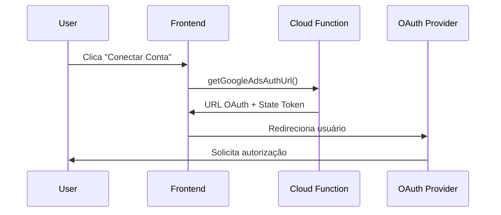
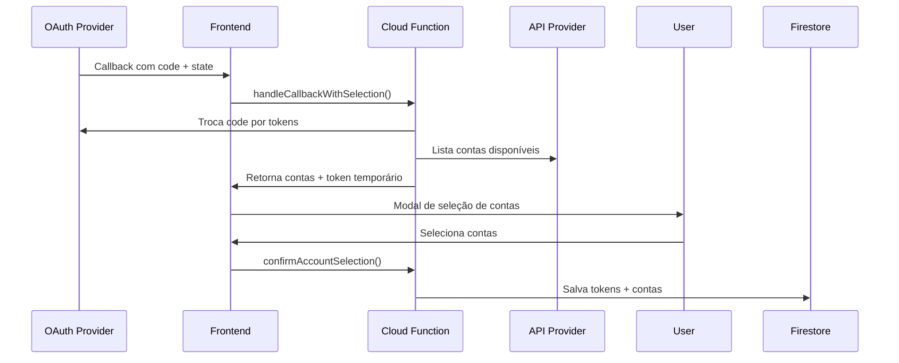

# 🔐 Integração OAuth - AdsMART

## 📋 Visão Geral

O AdsMART utiliza OAuth 2.0 para integração segura com Google Ads e Meta Ads. Esta documentação descreve o fluxo de autenticação e seleção de contas implementado.

## 🚀 Fluxo de Autenticação

### 1. Iniciação OAuth


### 2. Callback e Seleção de Contas


## 🏗️ Arquitetura

### Frontend Components

#### `AccountSelectionModal.tsx`
Modal responsivo para seleção de contas com:
- Exibição da conta principal (Google Account / Business Manager)
- Lista de contas de anúncios disponíveis
- Seleção múltipla com checkboxes
- Informações detalhadas (ID, moeda, status)

#### `OAuthCallbackPage.tsx`
Página de callback que:
- Processa o retorno do OAuth
- Exibe modal de seleção
- Gerencia estados de erro
- Confirma seleção com backend

### Backend Functions

#### Google Ads
- `getGoogleAdsAuthUrl`: Gera URL de autorização
- `handleGoogleAdsCallbackWithSelection`: Processa callback e lista contas
- `confirmGoogleAdsAccountSelection`: Confirma e salva contas selecionadas

#### Meta Ads
- `getMetaAdsAuthUrl`: Gera URL de autorização
- `handleMetaAdsCallbackWithSelection`: Processa callback e lista contas
- `confirmMetaAdsAccountSelection`: Confirma e salva contas selecionadas

## 🔧 Configuração

### 1. Variáveis de Ambiente

```bash
# .env (público)
GOOGLE_ADS_CLIENT_ID=your_client_id
GOOGLE_ADS_DEVELOPER_TOKEN=your_dev_token
META_ADS_APP_ID=your_app_id

# Firebase Secrets (privado)
firebase functions:secrets:set GOOGLE_ADS_CLIENT_SECRET
firebase functions:secrets:set META_ADS_APP_SECRET
```

### 2. URLs de Callback

Configure nos consoles das plataformas:

**Google Ads:**
- Produção: `https://your-app.web.app/auth/google-ads/callback`
- Desenvolvimento: `http://localhost:5173/auth/google-ads/callback`

**Meta Business:**
- Produção: `https://your-app.web.app/auth/meta-ads/callback`
- Desenvolvimento: `http://localhost:5173/auth/meta-ads/callback`

### 3. Permissões e Scopes

**Google Ads:**
```
https://www.googleapis.com/auth/adwords
```

**Meta Ads:**
```
ads_read,ads_management,business_management,read_insights
```

## 🔒 Segurança

### Tokens Temporários
- Tokens OAuth são armazenados temporariamente (30 min)
- Usuário deve confirmar seleção de contas
- Tokens são criptografados antes do armazenamento permanente

### State Tokens
- Previne ataques CSRF
- Validade de 10 minutos
- Vinculado ao usuário autenticado

### Validações
- Verificação de autenticação em todas as etapas
- Validação de state token
- Verificação de propriedade do token temporário

## 📝 Estrutura de Dados

### Firestore Collections

```typescript
// users/{userId}/oauth_tokens/google_ads
{
  accessToken: string (encrypted),
  refreshToken: string (encrypted),
  expiresAt: number,
  scope: string,
  updatedAt: Timestamp
}

// users/{userId}/adAccounts/{accountId}
{
  platform: 'google_ads' | 'meta_ads',
  accountId: string,
  accountName: string,
  email: string,
  currency: string,
  timezone: string,
  isActive: boolean,
  createdAt: Timestamp,
  updatedAt: Timestamp,
  lastSyncAt: Timestamp
}
```

## 🧪 Testando a Integração

### 1. Ambiente de Desenvolvimento

```bash
# Terminal 1 - Frontend
npm run dev

# Terminal 2 - Functions Emulator
cd functions
npm run serve
```

### 2. Teste Manual

1. Acesse `/accounts`
2. Clique em "Conectar" na plataforma desejada
3. Autorize no provedor OAuth
4. Selecione as contas no modal
5. Verifique se as contas aparecem na lista

### 3. Verificar Logs

```bash
# Logs das Cloud Functions
firebase functions:log --only handleGoogleAdsCallbackWithSelection

# Verificar Firestore
# Check: oauth_states, temporary_oauth_tokens, users/{userId}/adAccounts
```

## 🐛 Troubleshooting

### Erro: "State inválido"
- State token expirou (> 10 min)
- Usuário tentou usar state de outra sessão

### Erro: "Nenhuma conta encontrada"
- Usuário não tem acesso a contas de anúncios
- Permissões insuficientes na plataforma

### Erro: "Token expirado"
- Token temporário expirou (> 30 min)
- Usuário demorou para selecionar contas

## 📚 Referências

- [Google Ads API Documentation](https://developers.google.com/google-ads/api/docs/start)
- [Meta Marketing API](https://developers.facebook.com/docs/marketing-apis)
- [OAuth 2.0 RFC](https://tools.ietf.org/html/rfc6749)